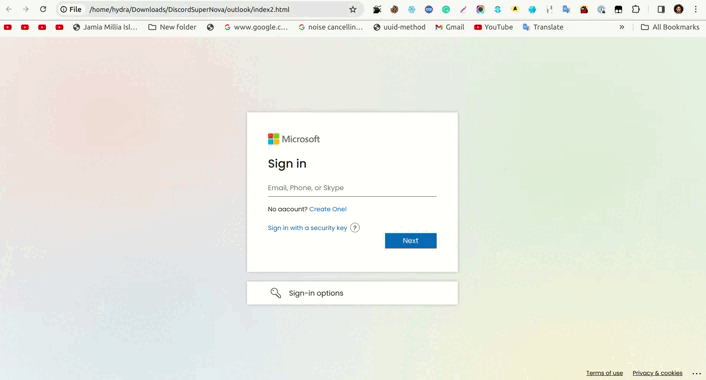

# Microsoft Login Clone

## Overview

This project is a clone of the Microsoft login page, created using only HTML and CSS. It serves as a demonstration of front-end web development skills and does not involve any actual authentication or functionality related to Microsoft.

## Features

- **Microsoft Branding**: The clone replicates the look and feel of the Microsoft login page, incorporating the official colors, fonts, and logo.

- **Responsive Design**: The login page is designed to be responsive, ensuring a consistent and user-friendly experience across various devices and screen sizes.

## Screenshots

Insert screenshots or GIFs showcasing the Microsoft login clone in different states, such as desktop and mobile views.



## Technologies Used

- HTML5
- CSS3

## Getting Started

To view the Microsoft login clone, follow these steps:

1. Clone the repository:
   ```bash
   git clone https://github.com/Mustkeem324/Microsoft-Login-Clone
   ```

2. Navigate to the project directory:
   ```bash
   cd Microsoft-Login-Clone
   ```

3. Open the `index.html` file in your preferred web browser.

## Contributing

Feel free to contribute to the project by submitting issues or pull requests. Please follow the [code of conduct](CODE_OF_CONDUCT.md) and [contribution guidelines](CONTRIBUTING.md).

## License

This project is licensed under the MIT License - see the [LICENSE](LICENSE) file for details.

## Acknowledgments

- Microsoft for the inspiration and design elements.

## Disclaimer

This project is for educational and portfolio purposes only. It does not involve any actual Microsoft services or authentication processes. Any resemblance to real products or services is purely coincidental.

## Author

MUSTKEEM AHAMD

MUSTKEEM324@GMAIL.COM

## Connect with Us

- https://t.me/cheggnx
- https://instagram.me/mustaqeem_abad
